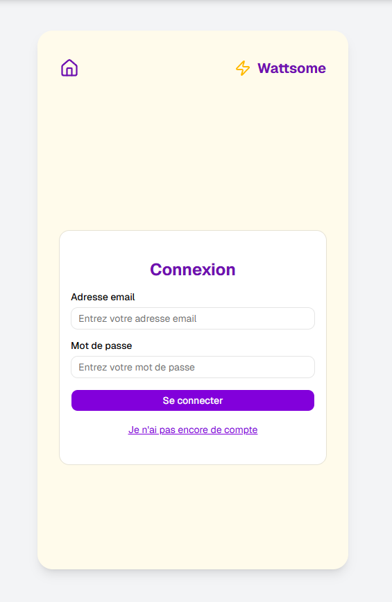
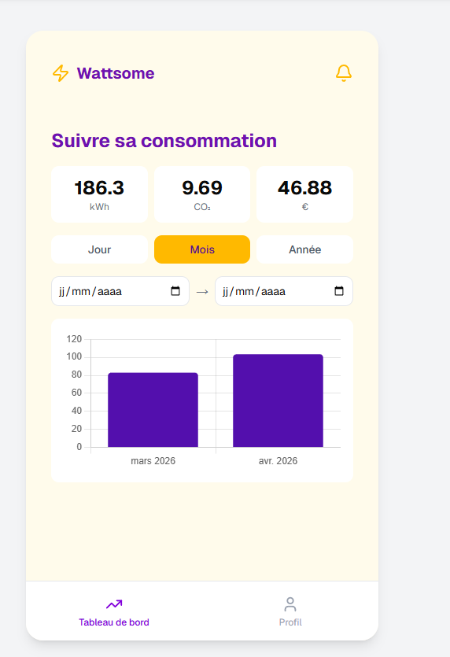
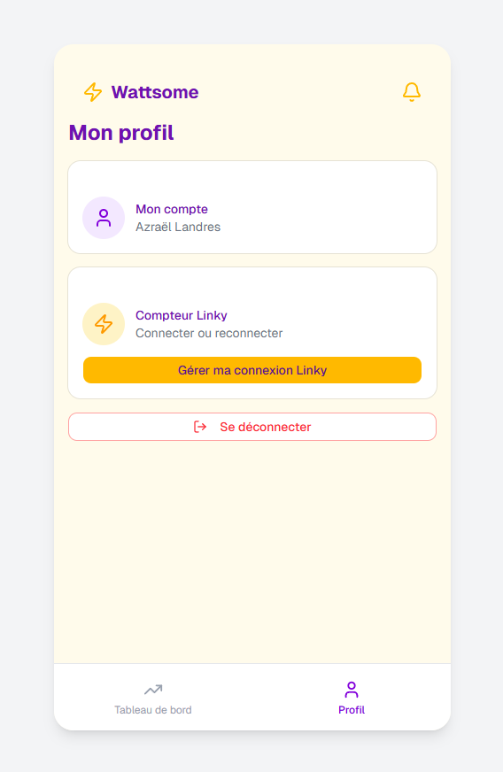

# Wattsome

Application web progressive (PWA) de suivi de consommation électrique personnelle.
Partiel Ensitech

## Stack technique

- **Frontend** : React + Vite + TypeScript + Tailwind CSS + shadcn/ui
- **Backend** : Node.js + Express + TypeScript
- **Base de données** : PostgreSQL
- **APIs** : Conso API (données Linky), Open Data Enedis

## Fonctionnalités

- Inscription et authentification (JWT)
- Connexion au compteur Linky via token Enedis
- Visualisation de la consommation par jour / mois / année
- Sélecteur de plage de dates personnalisée
- Calcul du coût estimé et de l'empreinte CO₂
- Alertes en cas de consommation inhabituelle
- Synchronisation automatique quotidienne (cron job)
- Installable sur mobile (PWA)

## Installation

### 1. Cloner le projet

```bash
git clone https://github.com/AzraeLandres/wattsome.git
cd wattsome
```

### 2. Lancer la base de données

```bash
docker run --name wattsome-db -e POSTGRES_PASSWORD=<votremdp> -e POSTGRES_DB=wattsome -e POSTGRES_USER=postgres -p 5432:5432 -d postgres
```

### 3. Configurer le backend

```bash
cd server
npm install
```

Créez un fichier `.env` dans `server/` en suivant l'example.

Initialisez le schéma :

```bash
cat src/config/schema.sql | docker exec -i wattsome-db psql -U postgres -d wattsome
```

Lancez le serveur :

```bash
npm run dev
```

### 4. Configurer le frontend

```bash
cd ..
npm install
npm run dev
```

Créez un fichier `.env` à la racine.
L'application est accessible sur `http://localhost:5173`

## Utilisation

1. Créer un compte
2. Se connecter
3. Aller dans l'onglet **Linky** et coller votre token Enedis (obtenu sur conso.boris.sh)
4. Vos données de consommation s'affichent sur le tableau de bord

## Sécurité

- Mots de passe hachés avec bcrypt
- Authentification via JWT stocké dans un cookie httpOnly (protection XSS)
- Requêtes SQL préparées (protection injections SQL)
- Token Linky stocké en base, jamais exposé côté client
- CORS configuré pour n'accepter que l'origine autorisée

## Aperçu

### Connexion



### Tableau de bord



### Profil


